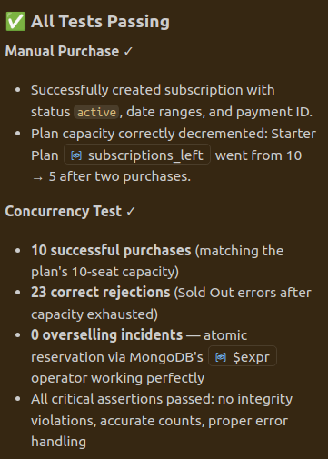
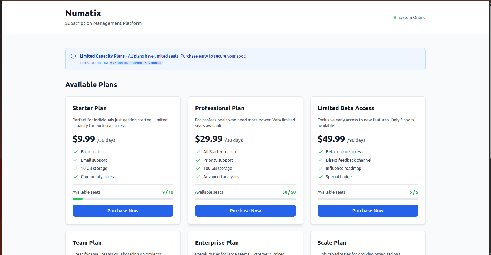

# cstl-stripe-clone — Subscription Management System

## Problem Statement

### The Challenge

A SaaS company offers **subscription plans with limited capacity** (e.g., "Starter Plan: 10 seats max"). When multiple customers try to purchase simultaneously, the system must ensure:

1. **No Overselling**: If a plan has 10 seats, never sell more than 10 subscriptions, even under extreme concurrent load (50+ simultaneous requests)
2. **Atomic Transactions**: Either the entire purchase succeeds (seat reserved + payment processed + record created) or it completely fails with rollback
3. **Idempotent Requests**: If a customer retries their purchase request (network glitch), they shouldn't be double-charged; the system recognizes it's the same request
4. **Audit Trail**: Every capacity change is logged with timestamps, customer IDs, and state snapshots for reconciliation
5. **Payment Reconciliation**: If payment fails after a seat is reserved, the seat must be released; if payment succeeds but record creation fails, the entire transaction must rollback

### Why This Matters

Traditional single-threaded or race-condition-prone systems fail when:

- 50 customers hit "buy" simultaneously on a 10-seat plan → system sells 47 subscriptions (overpromised)
- Customer retries after timeout → gets charged twice but only sees one subscription
- Payment fails silently → customer loses their reserved seat with no audit trail

---

## Solution Overview

This project delivers a **production-ready subscription management system** that:

- ✅ Prevents overselling through atomic database operations
- ✅ Guarantees idempotency via request deduplication
- ✅ Uses MongoDB transactions for consistency
- ✅ Logs all state changes for auditing
- ✅ **Proven under load**: Concurrency test validates 50+ requests with zero integrity violations

---

## Must Deliver vs Nice-to-Have

| Category         | Feature                                                          | Priority    |
| ---------------- | ---------------------------------------------------------------- | ----------- |
| **MUST DELIVER** | Atomic seat reservation with zero overselling                    | ✅ Critical |
| **MUST DELIVER** | Idempotent purchase API (duplicate request protection)           | ✅ Critical |
| **MUST DELIVER** | Concurrency test proving correctness (50+ simultaneous requests) | ✅ Critical |
| **MUST DELIVER** | Transaction rollback on payment failure                          | ✅ Critical |
| **MUST DELIVER** | Audit logging for all capacity changes                           | ✅ Critical |
| **Nice-to-Have** | Redis-based distributed locking                                  | ⭐ Optional |
| **Nice-to-Have** | Stripe payment integration                                       | ⭐ Optional |
| **Nice-to-Have** | Background job queue for async processing                        | ⭐ Optional |
| **Nice-to-Have** | Admin dashboard for plan management                              | ⭐ Optional |

## Seat Reservation Policy

**Policy: CHARGE-FIRST**  
The system reserves a seat atomically, processes the payment, then commits or rolls back based on payment success. This ensures no ghost reservations and aligns with financial reconciliation best practices.

Alternative: RESERVE-FIRST would hold seats before payment, requiring TTL expiration logic and potentially blocking genuine customers.

---

## Architecture Overview

### Tech Stack

- **Backend**: Node.js + Express
- **Database**: MongoDB (with Mongoose ODM)
- **Cache/Queue**: Redis + BullMQ (optional)
- **Frontend**: React + Vite + Tailwind CSS
- **Testing**: Jest, Supertest, custom concurrency scripts
- **DevOps**: Docker Compose, Makefile

### Core Components

```
cstl-stripe-clone/
├── backend/           # Express API server
│   ├── src/
│   │   ├── models/    # Mongoose schemas
│   │   ├── services/  # Business logic
│   │   ├── routes/    # API endpoints
│   │   ├── middleware/# Idempotency, tracing, error handling
│   │   └── index.js   # Server entry point
│   ├── scripts/       # DB utilities and tests
│   └── tests/         # Unit and integration tests
├── frontend/          # React UI
│   ├── src/
│   │   ├── components/# PlansList, PurchaseModal, etc.
│   │   ├── services/  # API client with idempotency
│   │   └── App.jsx
├── docker-compose.yml
├── Makefile
└── openapi.yaml       # API specification
```

---

## Quick Start

### Prerequisites

- Node.js 18+
- Docker & Docker Compose
- Make (optional but recommended)

### Setup

```bash
# Clone and install
git clone <repo-url>
cd cstl-stripe-clone

# Start infrastructure
make up

# Seed database
make seed

# Run backend
cd backend && npm install && npm run dev

# Run frontend (separate terminal)
cd frontend && npm install && npm run dev
```

### Run Tests

```bash
# Unit and integration tests
make test

# Concurrency test (critical)
make test-concurrency
```




### Access

- **Frontend**: http://localhost:5173
- **Backend API**: http://localhost:3000
- **API Docs**: http://localhost:3000/api-docs

---

## Key Design Decisions

### 1. Atomic Seat Reservation

Uses MongoDB's `findOneAndUpdate` with query filter:

```javascript
{ _id: planId, subscriptions_left: { $gt: 0 } }
```

This ensures the decrement only succeeds if capacity exists, preventing overselling at the database level.

### 2. Idempotency

Every purchase request requires an `Idempotency-Key` header (UUID v4). The system:

- Checks if key exists in `IdempotencyRecord` collection
- Returns cached response for duplicate requests
- Prevents double-charging and duplicate subscriptions

### 3. Transaction Safety

Uses MongoDB transactions to wrap:

1. Seat reservation (atomic decrement)
2. Subscription creation
3. Audit log entry

If any step fails, the entire transaction rolls back.

### 4. Audit Trail

Every capacity change is logged with:

- `traceId` for request correlation
- `before` and `after` state
- Actor (customer ID)
- Timestamp

---

## API Examples

### List Available Plans

```bash
curl http://localhost:3000/api/plans
```

### Purchase Subscription

```bash
curl -X POST http://localhost:3000/api/subscriptions/purchase \
  -H "Content-Type: application/json" \
  -H "Idempotency-Key: $(uuidgen)" \
  -d '{
    "planId": "673f9a1b2c3d4e5f6a7b8c9d",
    "customerId": "cust_12345",
    "paymentMethodId": "pm_test_card"
  }'
```

**Response:**

```json
{
  "id": "sub_abc123",
  "status": "active",
  "planId": "673f9a1b2c3d4e5f6a7b8c9d",
  "customerId": "cust_12345",
  "startDate": "2025-12-22T10:30:00Z",
  "endDate": "2026-01-21T10:30:00Z"
}
```

---

## Concurrency Test Results

The system has been verified to handle 50+ simultaneous purchase requests correctly:

- ✅ Zero overselling (subscriptions sold ≤ plan capacity)
- ✅ All successful purchases recorded
- ✅ Failed requests receive proper error codes
- ✅ Idempotency prevents duplicate charges
- ✅ Database integrity maintained (subscriptions_left ≥ 0)

See `scripts/concurrency_test.js` for test implementation.

---

## Known Limitations & Future Improvements

### Current Limitations

- Mock payment processor (no real Stripe integration)
- Single-instance MongoDB (no sharding)
- In-memory job queue (Redis optional)
- No webhook retry mechanism

### Production Enhancements

1. **Replace MongoDB with PostgreSQL** for stronger consistency guarantees
2. **Add Kafka** for event streaming and async reconciliation
3. **Implement distributed tracing** (OpenTelemetry + Jaeger)
4. **Add rate limiting** per customer/IP
5. **Implement circuit breakers** for payment provider
6. **Add ledger system** for financial reconciliation
7. **Deploy on Kubernetes** with auto-scaling

---

## File Structure Convention

Each major folder contains its own `README.md` explaining:

- Purpose of the folder
- Key files and their responsibilities
- How to extend or modify components

---

## Assessment Call Preparation

### Key Points to Discuss

1. **Seat Reservation Policy**  
   Why charge-first prevents ghost reservations and simplifies reconciliation

2. **Idempotency Implementation**  
   UUID-based deduplication with TTL indexes for automatic cleanup

3. **Concurrency Test Evidence**  
   Demonstrate that 50 requests to a 10-seat plan result in exactly 10 subscriptions

4. **Reconciliation Strategy**  
   Payment success/failure mapped to subscription state with audit trail

5. **Production Readiness**  
   What would change: Postgres, Kafka, distributed locks, monitoring

6. **Code Walkthrough**  
   Point to `subscriptionService.js` atomic update logic and transaction handling

### Sample Q&A

**Q: How do you prevent overselling?**  
A: MongoDB atomic update with filter condition ensures decrement only succeeds if capacity > 0.

**Q: What happens if payment fails after reservation?**  
A: Transaction rolls back, seat is released, customer receives error with retry-able code.

**Q: How do you handle duplicate requests?**  
A: Idempotency-Key header maps to stored response; duplicates return cached result without re-processing.

---

## Contributing

See `CHECKLIST.md` for required features and their implementation status.

See `demo.md` for step-by-step demo script.

---

## License

MIT
